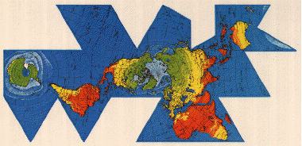
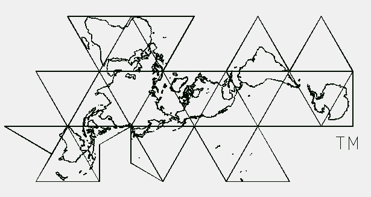

<!-- Date: 6 January 2016 16:06:38 -->

> *Mirrorer Note:*
> *Mirror of [http://www.rwgrayprojects.com/rbfnotes/maps/graymap1.html](http://www.rwgrayprojects.com/rbfnotes/maps/graymap1.html), the website of Robert W. Gray.*
>
> *Any text with in `[]` has been added by the mirrorer, and was not written by Robert W. Gray.*  
> *Notes by the mirrorer are presented as 'Mirrorer note:' in a block quote, like what you are reading. These provide additional information, including external links.*  
> *It should be also be noted that the only layout that has been altered is the navigation, everything else will remain the same.*
> *Read the [README](../README.md "README.md") for more information.*

[Home](../index.md "Home") | [README](../README.md "README.md") | [Table of Contents](../table_of_contents.md "Table of Contents")

# Robert W. Gray's Buckminster Fuller Notes

## Notes to Fuller's World Maps

Because of the amount of information I have accumulated on Fuller's world maps, particularly the icosahedron based map, I have divide the information into many different parts.  But first, here is an example of Fuller's Icosahedron based world map (sometime refereed to as the DymaxionTM map.)

*Disclaimer:  
The word Dymaxion and the Fuller Projection DymaxionTM Map design are trademarks of the Buckminster Fuller Institute, Santa Barbara, California, (c) 1938, 1967 & 1992. All rights reserved.  
You can contact the BFI at [bfi@aol.com](mailto:bfi@aol.com).*

I have published 2 papers on Fuller's maps. The references are:

1. Gray, Robert W., Fuller's DymaxionTM Map, *Cartography and Geographic Information Systems*, 21(4): 243-246, 1994.
1. Gray, Robert W., [Exact Transformation Equations For Fuller's World Map](http://www.utpjournals.press/doi/abs/10.3138/1677-3273-Q862-1885 "University of Toronto Press utpjournals.press"), *Cartographica*, 32(3): 17-25, 1995. 

Here is a list of various information on Fuller's map from which
to choose

- [General info about Fuller's map.](graymap2.html)
- [Different approaches to the transformation problem.](graymapa.html)
- [Area distortion of the map.](graymap3.html)
- [Coordinates for icosahedron the orientation](graymap4.html)
- [C language source code for Longitude-Latitude to xy-coordinate transformation.](graymap6.html) 
- [Visual comparison of Fuller's map to the Gnomonic and Snyder's equal area projections.](graymap7.html)

[Home](../index.md "Home") | [README](../README.md "README.md") | [Table of Contents](../table_of_contents.md "Table of Contents")

Usage Note: My work is copyrighted. You may use my work but you may *not* include my work, or parts of it, in *any* for-profit project without my consent.

[rwgray@rwgrayprojects.com](mailto:rwgray@rwgrayprojects.com)
