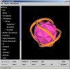

<!-- Date: 6 January 2016 23:58:26 -->
<!-- Mirrored from www.rwgrayprojects.com/ by HTTrack Website Copier/3.x [XR&CO'2014], Wed, 06 Jan 2016 19:03:09 GMT -->

> *Mirrorer Note:*  
> *Mirror of [http://www.rwgrayprojects.com/](http://www.rwgrayprojects.com/) ([mirror of original](../orginal/www.rwgrayprojects.com/index.html "Notes to Fuller's World Maps")), from [the website of Robert W. Gray](http://www.rwgrayprojects.com/ "rwgrayprojects.com").*
>
> *Any text with in `[]` has been added by the mirrorer, and was not written by Robert W. Gray.*  
> *Notes by the mirrorer are presented as 'Mirrorer note:' in a block quote, like what you are reading. These provide comments and  additional information.*  
> *It should be also be noted that the only layout that has been altered is the navigation, everything else will remain the same.*
> *Read the [README](../../../README.md "README.md") for more information.*

Home | [README](../README.md "README.md") | Table of Contents

# Robert W. Gray's HomePage

## The Projects of R. W. Gray

I have been and continue to be involved in a diverse collection of projects. I hope that you will find something of interest here. Below I list several general topics.  There is much more detail behind these selections.

"According to Karl Popper, the true scientist is someone who tries to contradict his own assumptions." - Quoted from <i>The Memory of Water: Homoeopathy and the Battle of Ideas in the New Science</i> by Michel Schiff, Thorsons, 1994, p. 110.

I would add: And encourages others to do the same, both for his, as well as for their own, assumptions.

[Optics Studies](../orginal/www.rwgrayprojects.com/optics/index.html) - I completed my Ph.D. in Optics in the Fall of 2015.  My dissertation topic was on wavefront and nodal aberration theory applied to space telescopes and to optical imaging systems having freeform surface shapes.  This section of the website contains my dissertation and other Optics related notes.

[SEM/TEM/STEM Training](../orginal/www.rwgrayprojects.com/SEMTEM2009/index.html) - I took a course (Spring term, 2009) at the University of Rochester on scanning electron microscopy (SEM), transmission electron microscopy (TEM), and scanning TEM (STEM).  The class also included electron lithography using the SEM. This is my class project.

[Geometric Algebra](../orginal/www.rwgrayprojects.com/GeometricAlgebra/ga01.html) - I have begun to study Geometric Algebra: The mathematical system which Physics, Engineering, Computer Science, and other scientific disciplines are moving toward. This will replace vector calculus, complex analysis, quaternions, spinors, and a whole lot more. (Not so much "replace" as unify).

[Geometric Coffee Tables](../orginal/www.rwgrayprojects.com/coffetables/ct01.html) - I am in the process of designing and building several coffee tables and other furnature using various polyhedra relationships. 

[An Introduction to Polyhedra and the Jitterbug](../orginal/www.rwgrayprojects.com/OswegoOct2001/Presentation/prsentationWeb.html) - Here is a web version of a presentation I gave at the State University of New York, Oswego, Department of Technology's 63rd Annual Fall Conference, Oct. 25-26, 2001. 

[Electrical Energy](../orginal/www.rwgrayprojects.com/energy/energy01.html) - The problem of electrical energy generation, along with energy in general, is <I>the</I> most critical issue facing the human race. Everything from the world economy, standard of living, "national security", health, environmental issues, species extinction, … all comes down to energy generation and usage. In paticular, electrical energy generation. 

[Exploring How Universe Works](../orginal/www.rwgrayprojects.com/Universe/universe.html) - Here I present some of the work I have been doing with other people to try to figure out how Universe works. (Lots of pictures and animations). (05-30-2002).

[My R. Buckminster Fuller Notes](./rbf_notes/table_of_contents.md) - A large collection of my notes with respect to R. Buckminster Fuller's work, as well as links to Fuller's work on the web.

[1997-1998 Dome Project](../orginal/www.rwgrayprojects.com/DP98/intro.html) - Here are some photos of a dome frame I built with students at Oswego University. 

[P.D. Structures](../orginal/www.rwgrayprojects.com/company/company.html) - I have considered starting a company to manufacture Jay Baldwin type Pillow Domes. These domes would range in size from about 20 to 45 feet in diameter and would be designed to be very transparent. Funding is lacking for experimentation.

[R.I.A.P.](../orginal/www.rwgrayprojects.com/RIAP/RIAPHP.html) - I am helping a research organization called the Research Institute On Anomalous Phenomena which is located in Kharkov, Ukraine. This is a group of scientist mostly investigating UFO related topics. Would you like to subscribe to their Bulletin (in English)? (On-line and print versions exist.)

[Java 3D](../orginal/www.rwgrayprojects.com/Java3D/Intro.html) - I am in the process of learning how to code in Java 3D. These projects are aimed at developing programs for displaying and manipulating polyhedra and other geometric objects. Here are some examples.

### Useful and Interesting Links

[Rafiki - Geometry of the Genetic Code](http://www.codefun.com/) - Here is an interesting web page by Mark White exploring the geometry of the genetic code. You can buy models from his web site.

[Physics links of interest](../orginal/www.rwgrayprojects.com/links/links01.html) - Here are a collection of links to various Physics related web sites. 

[HowStuffWorks](http://www.howstuffworks.com/) - A pretty good website which explains how stuff works.

Home | [README](../README.md "README.md") | Table of Contents

Usage Note: My work is copyrighted. You may use my work but you may *not* include my work, or parts of it, in *any* for-profit project without my consent.

[rwgray@rwgrayprojects.com](mailto:rwgray@rwgrayprojects.com)