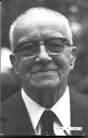

<!-- Date: 7 January 2016 00:37:14 -->
<!-- Mirrored from www.rwgrayprojects.com/rbfnotes/toc.html by HTTrack Website Copier/3.x [XR&CO'2014], Wed, 06 Jan 2016 19:15:13 GMT -->

> *Mirrorer Note:*  
> *Mirror of [http://www.rwgrayprojects.com/rbfnotes/toc.html](http://www.rwgrayprojects.com/rbfnotes/toc.html) ([mirror of original](../../orginal/rbfnotes/toc.html "Notes to Fuller's World Maps")), from [the website of Robert W. Gray](http://www.rwgrayprojects.com/ "rwgrayprojects.com").*
>
> *Any text with in `[]` has been added by the mirrorer, and was not written by Robert W. Gray.*  
> *Notes by the mirrorer are presented as 'Mirrorer note:' in a block quote, like what you are reading. These provide comments and  additional information.*  
> *It should be also be noted that the only layout that has been altered is the navigation, everything else will remain the same.*
> *Read the [README](../../README.md "README.md") for more information.*

- - -

[Home](../../index.md "Home") | [README](../../README.md "README.md") | Table of Contents

- - -

# Notes to R. Buckminster Fuller's Work

## Notes to R. Buckminster Fuller's Work

R. Buckminster Fuller once wrote "Don't try to make me consistent. I am learning all the time."Admittedly, I <I>am</I> trying to make Fuller consistent. I have been studying Fuller's work for several years and I am now in the process of making my notes available through these web pages. I hope that by working together we can go through  Fuller's work and pull together a consistent presentation of his ideas. Being a physics and mathematics oriented person, I have concentrated on Fuller's science and mathematics related work. Even if you're not science oriented I hope you'll find these pages interesting. 

### List of subjects…

Here is a Table of Contents style list of the main subjects which I am exploring with respect ot R. Buckminster Fuller's work. Links to others people's work are listed, mostly at the bottom.

- [Gallery of Images](gallery/gallery1.html)
- [Articles by R. Buckminster Fuller](fpapers/articles.html)
    - ["Tensegrity", Portfolio and Art News Annual, No. 4, 1961](fpapers/tensegrity/tenseg01.html)
- Books by R. Buckminster Fuller
    - [Synergetics](../synergetics/synergetics.html)
    - [Synergetics Dictionary](../SynergeticsDictionary/SD.html)
    - [Operating Manual for Spaceship Earth](http://bfi.org/node/422)
    - [Education Automation](http://www.bfi.org/education_automation.htm)
    - [Grunch of Giants](http://bfi.org/node/406)
    - [World Design Science Decade Documents](http://bfi.org/our_programs/who_is_buckminster_fuller/design_science/design_science_decade/world_design_science_decade_documents_by_r_buckminst)
- Books about R. Buckminster Fuller
    - ["A Fuller Explanation: The Synergetic Geometry of R. Buckminster Fuller " by Amy C. Edmondson](http://books.google.com/books?id=F6n2dZJ1POwC&printsec=frontcover&dq=a+fuller+explanation&cd=1#v=onepage&q=&f=false) This is the new edition.
    - ["A Fuller Explanation: The Synergetic Geometry of R. Buckminster Fuller " by Amy C. Edmondson](http://www.angelfire.com/mt/marksomers/40.html) This is an old edition. See previous link for latest edition.
    - ["BuckyWorks: Buckminster Fuller's Ideas for Today" by J. Baldwin](http://www.thirteen.org/bucky/buckyworks.html)
- Audio Material
    - [Transacript to video: "Everything I Know"](http://bfi.org/our_programs/who_is_buckminster_fuller/online_resources/everything_i_know)
- Notes for Synergetics
    - [Synergetic Volume Conversion Constant](VolConstant/VolConstant.html)
    - [How to calculate Synergetics Tetra-volumes of polyhedra](SynVolCalc/SynVolCalc.pdf)
    - [Synergetics Errata](errata/grayer1.html)
    - [From Ed Applewhite's Files](errata/edapple1.html)
    - Summary: Universe 101
- [Pillow Dome Project](pillow/pillow.html)
- [Great Circles (Railroad Tracks of Energy)](greatc/greatc1.html)
    - [Description/Significance](greatc/greatc1.html)
    - [VE's Great Circles](greatc/gcvep.html)
        - [Primary](greatc/gcvep.html)
        - [Secondary](greatc/gcves.html)
    - [Icosahedron's Great Circles](greatc/gcicp.html)
        - [Primary](greatc/gcicp.html)
        - [Secondary](greatc/gcics.html)
    - [Combined Primary Great Circles](greatc/gcvip.html)
- Polyhedra Data
    - [Polyhedra Encyclopedia](polyhed/pindex.html)
    - [The Jitterbug Data](polyhed/jitterbug/jbCurve.html)
    - [Tetrahelix Data](helix/helix01.html)
    - Kajikawa's Polyhedra
- Polyhedra Models of ...
    - Crystals
    - Quasicrystals
    - Molecules
    - Nuclei
- [Citations and References to R.B. Fuller and Related Work](citation/grayct1.html)
    - [Social Science Citation Index](citation/grayct2.html)
    - [Science Citation Index](citation/grayct3.html)
    - [Other R.B.Fuller Related References](citation/grayct5.html)
    - [References: Models in the Sciences](citation/grayct4.html)
- [Fuller's World Maps](maps/graymap1.html)
    - [Description](maps/graymap2.html)
    - [Different approaches](maps/graymapa.html)
    - [Area Distortion Comparison](maps/graymap3.html)
    - [Icosahedron Coordinates](maps/graymap4.html)
    - My transformation equations
    - [My C Program](maps/graymap6.html)
    - [Visual Comparison](maps/graymap7.html)
-   Tensegrity Structures
    - [Gerald de Jong's STRUCK modeler](http://www.xs4all.nl/~gdj)
    - [Donald Ingber's Cell Structure](tensegrity/ingber.html)
    - [Ken Snelson's Art](http://www.kennethsnelson.net/)
-   [Trigonometry](trig/trig1.html)
    - [Plane Trig. Relations](trig/ptrig/trig.html)
    - [Spherical Trig. Relations](trig/strig/strig.html)

- - -

## Links to Other People's Web Sites

- [The Buckminster Fuller Institute](http://www.bfi.org/) - News letters, products, on-line audio clips, articles, etc.
- [Synergetics Collaborative (SNEC):](http://snec.synergeticists.org/) a 501(c)(3) non-profit organization dedicated to bringing together a diverse group of people with an interest in Buckminster Fuller's Synergetics.
- [Joe Moore's Buckminster Fuller Virtual Institute](http://www.buckminster.info/)
- [Kirby Urner's Synergetics on the Web](http://www.grunch.net/synergetics/index.html) - Fantastic site full of clear presentations, very nice graphics. 

- - -

[Home](../../index.md "Home") | [README](../../README.md "README.md") | Table of Contents

- - -

Usage Note: My work is copyrighted. You may use my work but you may *not* include my work, or parts of it, in *any* for-profit project without my consent.

[rwgray@rwgrayprojects.com](mailto:rwgray@rwgrayprojects.com)
